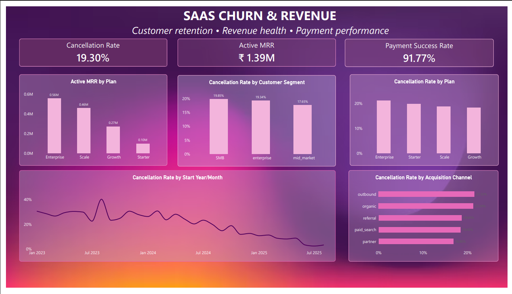

# SaaS Churn & Revenue Analytics

A portfolio project built around a simple business question: **where is a SaaS business losing customers, and what does that mean for recurring revenue?**

I worked with subscription, customer, plan, and payment data to explore churn patterns, identify which plans contribute most to MRR, and check payment performance.

The analysis was done using **Python/Pandas and SQL**, with the results presented in **Power BI**.

---

## 📊 Dashboard



[📄 View Dashboard PDF](dashboard/SaaS_Churn_Dashboard.pdf)

---

## 📌 At a Glance

| Metric | Result |
|---|---:|
| Total Subscriptions | 5,000 |
| Cancelled Subscriptions | 965 |
| Cancellation Rate | **19.30%** |
| Active MRR | **₹1.39M** |
| Payment Success Rate | **91.77%** |

---

## 🔎 What I Looked At

| Area | Analysis |
|---|---|
| Churn | Overall cancellation rate |
| Plans | Cancellation rate by plan |
| Customers | Cancellation rate by segment |
| Acquisition | Churn by acquisition channel |
| Revenue | Active MRR by plan |
| Revenue Mix | MRR contribution by plan |
| Payments | Successful vs failed payments |

---

## 📈 Key Findings

### Churn

| Dimension | Highest Cancellation Rate |
|---|---:|
| Plan | Enterprise — **21.20%** |
| Segment | SMB — **19.85%** |
| Acquisition Channel | Outbound — **21.53%** |

The overall cancellation rate is **19.30%**.

### Revenue

| Plan | Active MRR | Share of Active MRR |
|---|---:|---:|
| Enterprise | ₹558K | **40.22%** |
| Scale | ₹459K | **33.08%** |
| Growth | ₹272K | **19.61%** |
| Starter | ₹98K | **7.09%** |

**Enterprise + Scale = 73.30% of active MRR.**

### Payments

| Payment Status | Attempts | Share |
|---|---:|---:|
| Succeeded | 80,101 | **91.77%** |
| Failed | 7,186 | **8.23%** |

---

## 💡 Business Takeaways

- Enterprise has the highest plan-level cancellation rate while also generating the most MRR, making retention of these customers particularly important.
- Outbound acquisition has the highest cancellation rate, while Partner has the lowest at **16.80%**.
- Active recurring revenue is heavily concentrated in the Enterprise and Scale plans.
- Around **8% of payment attempts fail**, making payment recovery a potential area for improvement.

These are descriptive findings from the available data and do not establish causation.

---

## 🛠️ Tools & Workflow

**Python / Pandas**  
Data loading, exploration, cleaning, calculations, and analysis.

**SQL / SQLite**  
Business queries for churn, revenue, and payment analysis.

**Power BI**  
Dashboard creation and visualization.

```text
SQLite Database
      ↓
Python + Pandas
      ↓
SQL Analysis
      ↓
Power BI Dashboard
      ↓
Business Insights
````

---

## 📂 Project Structure

```text
saas-churn-analytics/
│
├── data/
│   ├── saas-subscriptions.sqlite
│   └── powerbi/
│       ├── accounts.csv
│       ├── payments.csv
│       ├── plans.csv
│       └── subscriptions.csv
│
├── sql/
│   ├── 01_overview.sql
│   ├── 02_churn_analysis.sql
│   ├── 03_revenue_analysis.sql
│   └── 04_payment_analysis.sql
│
├── notebooks/
│   └── SaaS_Analysis.ipynb
│
├── dashboard/
│   ├── SaaS_Churn_Dashboard.pbix
│   ├── SaaS_Churn_Dashboard.pdf
│   └── SaaS_Churn_Dashboard.png
│
└── README.md
```

---

## 📁 Dataset

The dataset is a **synthetic SaaS dataset** covering subscription activity from **2023–2025**.

Main tables:

* `plans`
* `accounts`
* `subscriptions`
* `invoices`
* `payments`

The data is fictional and used for analytics practice.

---

## 🚀 Project Outcome

This project brings together **Python, SQL, and Power BI** to analyze a SaaS business from three practical angles:

**Customer churn → Recurring revenue → Payment performance**

The final dashboard summarizes the main findings in a format that can be used for business review and further investigation.

